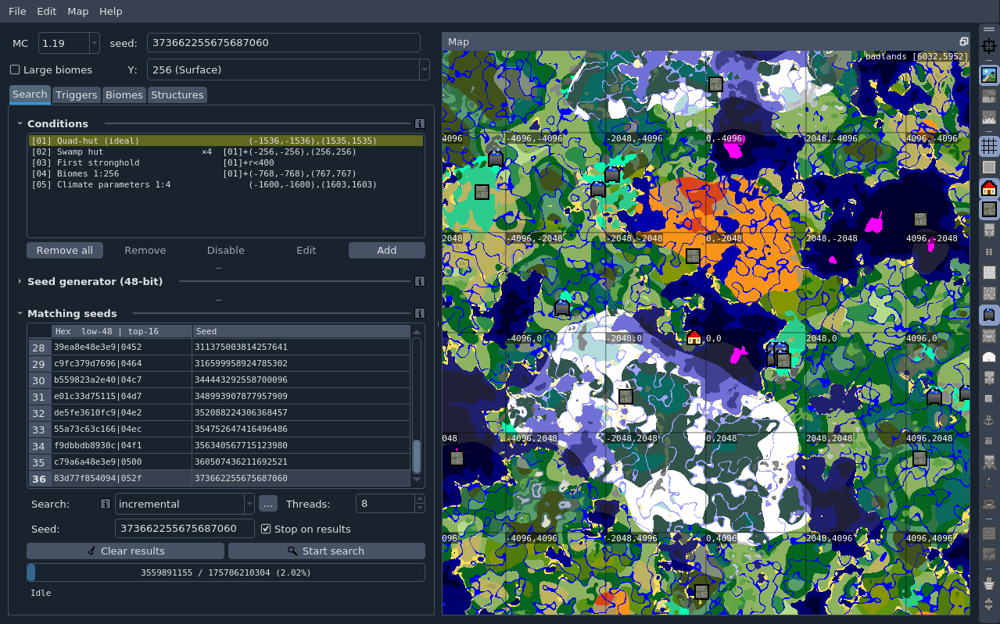

# Cubiomes Viewer

Cubiomes Viewer provides a graphical interface for the efficient and flexible
seed-finding utilities provided by [cubiomes](https://github.com/Cubitect/cubiomes)
and a map viewer for the Minecraft biomes and structure generation.

The tool is designed for high performance and supports Minecraft Java Edition
main releases 1.0 - 1.19.

## Download

Precompiled binaries can be found for Linux and Windows under
[Releases on github](https://github.com/Cubitect/cubiomes-viewer/releases).
The builds are statically linked against [Qt](https://www.qt.io) and should run
as-is on most newer distributions. For the Linux build you will probably have to
add the executable flags to the binary (github seems to remove them upon upload).

For Arch Linux users, the tool may be found in the
[AUR](https://aur.archlinux.org/packages/cubiomes-viewer) thanks to
[JakobDev](https://github.com/JakobDev).

Non-PC platforms, such as macOS, are not formally supported, but you can check
[here](https://github.com/Cubitect/cubiomes-viewer/issues/107) for more
information on this issue.

## Build from source

Build instructions can be found in the [buildguide](buildguide.md).

## Basic Feature Overview

The tool features a map viewer that outlines the biomes of the Overworld,
Nether and End dimensions, with a wide zoom range and with toggles for each
supported structure type. It is simple to cycle through a list of seeds or to
adjust the mincraft version on the fly.

The integrated seed finder is highly customizable using a hierarchical
condition system that allows the user to look for features that are relative to
one another. Conditions can be derived from a large selection of criteria among
structure placement, world spawn point and from the available biomes in an
area. Filters can use logic gates in the form of helper conditions for even
more control, as well as Quad-Hut and Quad-Monument seed generators to quickly
look for seeds that include extremely rare structure constellations.

